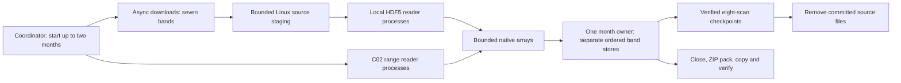
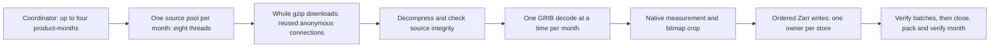

# GOES and MRMS fetching: concurrency and measured runtime

Use [study jobs](study_jobs.md) for current commands, [storage](storage_and_data_management.md) for
archive layout and access, and [status](status.md) for actual live work.

## Current GOES operating profile

The current configuration allows **two months to fetch at once**, plus one
additional month when only its C02 band remains unfinished. Each month has a
writer process that owns its band stores. This changes when work runs, not what
is stored: CMIPF still saves one native monthly ZIP per satellite, band and region.
C02 uses range reads; the other seven bands download complete files asynchronously
before local cropping. No ingestion-time interpolation or grid alignment occurs.

| Control | Selected value | Meaning |
|---|---:|---|
| `--month-writers` | 2 | Maximum month owners, each with separate band stores |
| `--tail-months` | 1 | One additional C02-only owner, sharing all global limits |
| `--download-concurrency` | 32 | Global full-object downloads across both months/seven bands |
| `--local-readers` | 2 | Global independent processes cropping downloaded HDF5 files |
| `--range-readers` | 8 | Global independent processes reading C02 remote file sections |
| `--roi-budget-mib` | 2,048 | Global reservations for returned arrays and copies between processes |
| `--staging-mib` | 16,384 | Global scratch capacity for staged source files |
| Range block size | 1 MiB | Cached remote block used by C02 readers |
| Finalizers | 2 | Workers packing/verifying closed band stores |

These limits are global, not multiplied by month or band. Arrays move between
reader, coordinator and writer processes; memory reservations account for copies.
HDF5 caches, Python runtime and compression buffers also consume memory. Report
measured total process memory separately from the queued-array budget.

## How work overlaps



An async download is an S3 request streaming a full source file to disk; it does
not hold that file in RAM or invoke HDF5. Persistent anonymous connections are
reused. Completed files can enter a local reader immediately while other downloads
continue. A reader crops the native ROI, preserving packed data and metadata.
C02 readers instead obtain remote file sections as HDF5 requests them.

Independent processes allow simultaneous HDF5 work; threads within one process
are serialized by h5py's lock. Async request count is not CPU thread count. More
readers/writers can increase waiting, memory copying and competition; they do not
automatically increase completed observations per hour.

Each month owner writes separate band stores in timestamp order. Slow observations
may delay that band's commit, but other bands remain eligible. The scheduler
reserves capacity for early observations so later results cannot block them.
The corrected first-frame rule briefly drains established reads when a new band's
initial size-measuring read is waiting. Eight-scan checkpoints verify stored pixels
and retire matching staged files. Finalizers operate only on closed stores.
A band completion is recorded immediately; the full month verifies after all bands.

A month with only C02 remaining can become the single tail month, freeing a
normal slot for the next chronological month. At most three month-owner processes
can exist: two normal and one C02-only. The tail shares the same reader and byte
budgets; it adds no download slots. A pause stops new admissions and drains every
already admitted normal and tail month. Keep the deterministic scratch locations on interruption.

## What the runtime and download rates measure

**Verified archive runtime** is the elapsed time needed to turn an already
selected set of observations into completed archives that can be opened for
analysis. The clock starts when fetching begins and stops after the arrays have
been written, the stores closed, the monthly ZIPs copied to their destination
and their contents checked. Earlier notes called this “readiness.”

This measurement includes downloading, decoding, cropping, writing and checking
the destination. It excludes finding the source files beforehand and removing
temporary benchmark files afterward. For example, a reported 60-second runtime
means the entire selected set was available after 60 seconds; it does not mean
each worker ran for 60 seconds. Because workers overlap, adding their individual
times would overstate elapsed runtime. Reports use `wall_s` or `wall_seconds`
for this elapsed measurement.

The status table's average Mb/s is bytes received divided by a task's elapsed
time, including waits for cropping and writing. It is therefore different from
the instantaneous speed shown by a network monitor. A band's average can fall
when it shares bandwidth with other bands even if total network use stays high.
Use completed observations per hour and whole-job runtime alongside these rates
when deciding whether a configuration helps.

## Measured evidence and limits

| Comparison | GOES-16 runtime | GOES-19 runtime | Interpretation |
|---|---:|---:|---|
| Previous pipeline: two months, eight observations per band | 86.18 s | 83.11 s | Three repeats, rotated order |
| Concurrent-month candidate, before scheduling fix | 55.49 s | 53.14 s | 35.6%/36.1% lower medians; not current corrected performance |
| Previous pipeline: smaller comparison sample | 33.50 s | 24.76 s | One month, four day/night observations per band, three repeats |
| Corrected concurrent scheduler: same smaller sample | 30.24 s | 28.63 s | Exact equality; absolute differences below four seconds |

The campaign used 509.84 GiB of its 512 GiB allowance across 98 cases. The largest
measured memory use across benchmark processes was 12.38 GiB, below the 48 GiB
limit. Each repeat used a fresh application cache, but operating-system file
caches were not cleared. Benchmark scratch
was RAM-backed `/tmp`, while production uses the Linux filesystem. Longer
comparisons showed advantages for concurrent scheduling before the scheduling fix;
that is not proof of corrected full-month throughput.

These small tests do not establish how long a complete production month will
take. The two-month limit was chosen after observing low per-band download rates
with four months active; it is not a newly measured speed improvement. Keep the
scientific checks and record completed production-month runtimes before drawing
that conclusion. Argonne settings need measurements on its hardware and network,
rather than being scaled from workstation thread counts.

## MRMS is a different pipeline

MRMS gzip files must be downloaded in full. Unlike GOES NetCDF, they cannot
serve useful geographic windows through remote HDF5 range reads. The network
step receives gzip bytes; decompression produces a GRIB2 message; ecCodes
then decodes its values and bitmap before we select the native Caribbean pixels.
There is [no HDF5 lock](https://docs.h5py.org/en/latest/threads.html) to bypass and no reason to copy GOES's C02 strategy.

The study retains **four product-month writers, eight source tasks per writer,
and one GRIB decoder per writer**. In total this permits up to 32 source tasks
and four concurrent GRIB decodes, on distinct stores:



The source-task limit is an upper bound, not a promise that eight network requests
are always active. A thread may finish downloading and wait for its decode slot;
a slow early observation can hold up ordered writes. The finite queue prevents
whole-month staging, and the next source task is submitted as the writer consumes
results. Downloads use a persistent anonymous obstore client within each worker,
with separate decode limits, byte/integrity checks and bounded retries. These
are relevant lessons shared with GOES. A further split between radar download
and decode services would need measured evidence of idle downloads or decode
waiting; it is not justified simply by workstation thread count.

Each product-month has one owner, verified eight-observation recovery batches,
and a completion marker only after destination read-back. Retain decoded numbers,
bitmap gaps and product-specific sentinels. Pass2 QPE is an hourly accumulation;
other study products are selected on ten-minute slots. Ingestion neither
interpolates nor treats all negative reflectivity as missing.

### Historical comparison with the mentor's sequential downloader

The original weekly tests support overlapping downloads instead of fetching
one file at a time. Both methods used the same region, observations, mentor
processing and temporary GeoTIFF outputs; values and geographic transforms
agreed. These are medians of three repeats:

| Pass2 hourly selection, end date excluded | Sequential mentor code | Four concurrent obstore workers |
|---|---:|---:|
| September 18–25, 2022: 167 available observations | 59.24 s | 9.55 s |
| September 15–22, 2024: 168 observations | 59.60 s | 9.71 s |

This is roughly a sixfold improvement for that processed-output workflow.
It is historical evidence for concurrency, not a timing of the current raw
monthly archives. The client-library comparisons did not establish a clear
S3FS-versus-obstore winner.

### Comparing with installed NVIDIA MRMS

Earth2Studio 0.18.0's stock MRMS uses whole gzip downloads through obstore,
expands GRIB files into its cache, runs pygrib decoding in worker threads, and
returns full-domain arrays. Its default region is **CONUS**, and its lexicon
contains composite/base reflectivity rather than our precipitation/shear/QPE
selection. A default CONUS result is not a speed baseline for a smaller CARIB
source file. [NVIDIA MRMS documentation](https://nvidia.github.io/earth2studio/main/modules/generated/data/analysis/MRMS/)

Inspection of the installed code also finds that the advertised `max_workers=24`
parameter is stored but is not used to bound `fetch()`'s timestamp tasks. The
short-call task count and underlying connection/thread limits matter; we must
not describe 24 as measured or enforced download concurrency. Our source-task
and decode bounds are explicit.

The repeatable small comparison is:

```bash
python scripts/dataset_jobs.py benchmark mrms \
  --location /mnt/p/ecore_eo_datasets \
  --frames-per-month 8 --repeats 3 --budget-mib 128 \
  --output results/study-mrms/source-benchmark.json
```

Run this only with a **verified study pause**, including no queued handoff that
will start a fetch during the experiment. The command checks for live fetch
coordinators before doing network work. It selects eight exact composite-reflectivity
observations from each of four completed monthly manifests, reuses their source
identities, and excludes discovery from the matched timings. It runs:

1. One unmodified stock CONUS observation and a similarly sized geographic crop,
   reported separately as a different workload.
2. NVIDIA's inherited reader with only `MRMS_REGION` changed to CARIB, versus
   the project's four independent source-reader groups, eight source tasks and
   one decoder each, on the **same 32 CARIB objects**.
3. Three rotated repeats with isolated application caches, valid-pixel/time
   equality checks outside timing, and a cumulative returned-byte budget.

NVIDIA's axes are reconstructed from GRIB headers; our reader uses ecCodes'
coordinate accessor. The report checks and records any small coordinate difference
rather than silently calling them identical. Stock missing bitmap cells may become
NaN; our reader keeps explicit bitmap information and numeric source encodings.
The comparison therefore checks equality on bitmap-valid pixels and makes no
claim of identical quality metadata. Timings include source reading, decoding,
process startup and crop availability; they **exclude** monthly Zarr packing and
DAS publication. The report keeps those measurement limits explicit.

### Completed MRMS source comparison, October 6, 2026

After the workstation restart, no competing fetch process was running. Eight
observations from each of September 2022, September 2024, September 2025 and
June 2026 were tested, with three rotated repeats and fresh application caches.
The installed reference was Earth2Studio 0.18.0. Compact measurements and source
hashes are in `results/study-mrms/source-benchmark.json`.

| Source workload | Median source-to-crop time | Returned bytes per matched repeat |
|---|---:|---:|
| NVIDIA reader adapted only to CARIB | 2.979 s | 1,723,518 |
| Project: four readers, eight downloads and one decoder each | 3.247 s | 1,723,518 |

The project was about 9% slower on this short 32-object sample, which includes
starting four processes. This does not establish long-month performance or
justify raising the download/decode limits. Keep the existing **four writers,
eight downloads each, one decoder each**. MRMS already downloads whole gzip
objects before decoding, so GOES's switch away from remote HDF5 does not apply.

Decoded bitmap-valid values, including valid negatives and sentinel encodings,
and actual observation times matched exactly. Header-built reference coordinates
differed from preserved ecCodes coordinates by at most **0.000000915 degrees**
(about 0.1 m). The benchmark permits at most two microdegrees for this explicitly
reported cross-library difference; exact source-to-archive coordinate checks
remain unchanged. Stock missing pixels and our explicit bitmap are different
representations, not a quality-metadata equality claim.

The separate, unmodified CONUS call and crop is reported in the JSON as a different
workload. The successful comparison returned 11.35 MiB in total; the initial
coordinate-check attempt returned another 4.78 MiB. Both remain below the
128 MiB experiment budget. Source timings exclude archive writing, ZIP packing
and DAS verification. No current result claims to beat NVIDIA's source.

### Completed local backend comparison, October 6, 2026

Six cached composite-reflectivity observations from September 2024 were converted
to the same float32 tensor for a controlled backend experiment. Each method ran
three times in rotated order on Linux `/tmp`, with no source download. Timing
includes backend setup, writing, closing and exact array read-back. It excludes
monthly ZIP packing and the DAS. Filesystem caches were not flushed.

| Installed Earth2Studio backend | Median elapsed time | Store size |
|---|---:|---:|
| Standard `ZarrBackend`, no array compression | 0.0965 s | 14,170,558 bytes |
| Standard `ZarrBackend`, Blosc/Zstd compression | 0.1025 s | 124,419 bytes |
| Nonblocking `AsyncZarrBackend`, compression and a six-frame shard | 0.1485 s | 125,057 bytes |

All nine read-backs were equal. Compression reduced this small store to **0.88%**
of the uncompressed backend size. The async configuration did not improve runtime
here; its shard/thread initialization is part of the measured work. The frames
are sparse, and this float32 control does not demonstrate raw float64/bitmap
preservation or generalize to all months/products. Maximum sampled process RSS
was about 0.95 GiB. It supports keeping the compressed standard local backend,
not a new claim about network throughput or the best chunk layout.

The tested environment was WSL Ubuntu, 32 logical CPUs, about 94 GiB RAM,
Earth2Studio 0.18.0, Zarr 3.3.0 and NumPy 2.5.3. The data modules' combined content
hash was `1cc1a60807cc9874f4e5aab318742fba752df629d33cf9f5bd2306b7bf894274`;
Git base was `c466633` with working-tree changes. Successful temporary stores
were removed; compact numbers are retained here rather than a new results tree.
The reusable command is `scripts/dataset_report.py benchmark --benchmark-kind
backend --source mrms --product MergedReflectivityQCComposite_00.50`, with a
specific completed month directory supplied through `--location`.

Training, parallax correction and 1 km preprocessing remain separate research
work. [GOES ROI study](goes_roi_training_study.md) discusses native pixel counts,
contextual margins and future training requirements.
